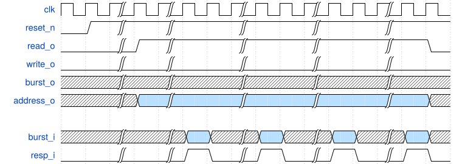
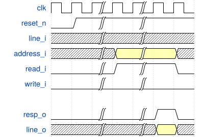
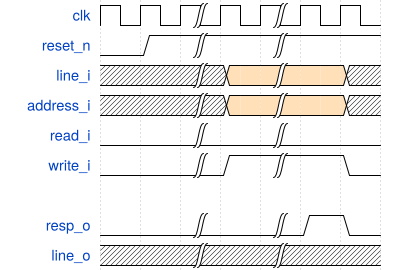

# Table of Contents

1.  [Overview](#org31a65dd)
2.  [Specification](#orge991d5b)
    1.  [Loads (from DRAM to LLC)](#org6e92359)
        1.  [Receiving Read Requests from the LLC](#org119ac92)
        2.  [Reading from DRAM](#org975f57e)
        3.  [Returning Data to the LLC](#orgfea7004)
    2.  [Stores / Cacheline Writebacks (from LLC to DRAM)](#org232a672)
        1.  [Receiving Write Requests from the LLC](#org9cd17d5)
        2.  [Writing to DRAM](#org7b1ead5)
    3.  [Annotated Interface](#org342f58f)
3.  [Coverage](#org4ce82f1)

# Overview

In this assignment, you will design a &ldquo;cacheline adaptor&rdquo; module. You will use this module again in MP3.

When typical microprocessors load or store a byte of data, the memory controller interfacing with DRAM will typically request an entire &ldquo;cacheline&rdquo; of data. These cachelines are typically 32 or 64 bytes data in the address space contiguous with the requested byte, and aligned to 32 or 64 byte boundries. However, pin limitations on packages, as well as the design of DRAM DIMMs make it infeasible to send an entire cacheline concurrently. Instead, DRAMs support burst transmission modes, in which the cacheline is sent over several cycles. You must design an adapter allow the smooth transmission of data between the LLC and DRAM despite this difference in transaction size.

# Specification

Your cacheline  adaptor will interface DRAM with a 4-burst 64-bit naive interface, and a straightforward 256-bit naive interface to last-level cache (LLC). A burst here means that a very long data will be send over the channel/interface over multiple cycles.

## Loads (from DRAM to LLC)

On a DRAM to LLC tranfer, your design must buffer data from memory until a burst is complete, and then respond to the LLC with the complete assembled cacheline. A DRAM burst is 64 bits of data, with 4 bursts over 4 cycles forming a single 256-bit cacheline.

### Receiving Read Requests from the LLC

Your cacheline adaptor will first recieve read requests from the LLC. The LLC will output a request address and assert the read signal (which means it will raise the signal, not to be confused with C assertions).

### Reading from DRAM

To read data from DRAM, raise the read signal while holding the address signal constant. These signals should remain unchanged until the DRAM responds. While the response signal is high, the data from `burst_i` is valid. The four bursts will correspond to data from 0 to 256 bit at the specified address. The following waveform shows a DRAM read.

### Returning Data to the LLC

Once data is buffered and assembled as a cacheline, raise the response signal for a single clock cycle to alert the LLC. The cacheline data must be stable for the full clock cycle that `resp_o` is raised. The following waveform shows data being returned to the LLC.

## Stores / Cacheline Writebacks (from LLC to DRAM)

When transmitting data from the LLC to DRAM, your design must buffer a cacheline from the LLC, segment the data into appropriate sized blocks for burst transmisison, and transmit the blocks to memory. Since burst are each 64 bits (1/4 of the cacheline), the cacheline should be segmented into 4 chunks, each written back to the appropriate memory addresses (these can be calculated from the cacheline base address).

### Receiving Write Requests from the LLC

The address and data to be written from the LLC will be present while the write signal is asserted. These will remain stable until the response signal is raised to the LLC, indicating to the cache that the writeback has successfully been completed. The following waveform shows data being written from the LLC.

### Writing to DRAM

To write data to DRAM, raise the write signal once the address and input data are correct/valid. These signals should be held until the DRAM responds, and the next data can be driven on the data bus while holding the address constant. Once all (4) bursts are complete the write signal can be disasserted. The following waveform shows data being written to DRAM.

## Annotated Interface

As stated above, your design will sit between the LLC and memory subsystems, and therefore must interact with both of them using their accepted interfaces. Your module may only use the signals defined by the module stub provided. Their purpose of each is annotated below, but should also be made clear by the example waveforms provided above.

    module cacheline_adaptor
    (
        input                clk,
        input                reset_n,
    
        // All _i and _o here are from the perspective of your cacheline adaptor
    
        // Port to LLC (Lowest Level Cache)
        input logic [255:0]  line_i,    // cacheline to be written to memory by LLC
        output logic [255:0] line_o,    // cacheline to be written to LLC
        input logic [31:0]   address_i, // address of cacheline to be read / written
        input                read_i,    // signifies a read from LLC
        input                write_i,   // signifies a write from LLC
        output logic         resp_o,    // on reads, signifies that line_o is valid and the read is complete \
                                        // on writes, signifies that the write is complete
    
        // Port to memory
        input logic [63:0]   burst_i,   // burst of data read from memory
        output logic [63:0]  burst_o,   // burst of data to be written to memory
        output logic [31:0]  address_o, // address of data to be read / written
        output logic         read_o,    // signifies a read to memory
        output logic         write_o,   // signifies a write to memory
        input                resp_i     // on reads, signifies that burst_i is valid and the read is complete \
                                        // on writes, signifies that the write is complete
    );
    endmodule : cacheline_adaptor

# Coverage

We have provided a testbench for this portion of the MP. If your cacheline adapter works with the provided tests, it is *most-likely* correct (for the purposes of this class).

