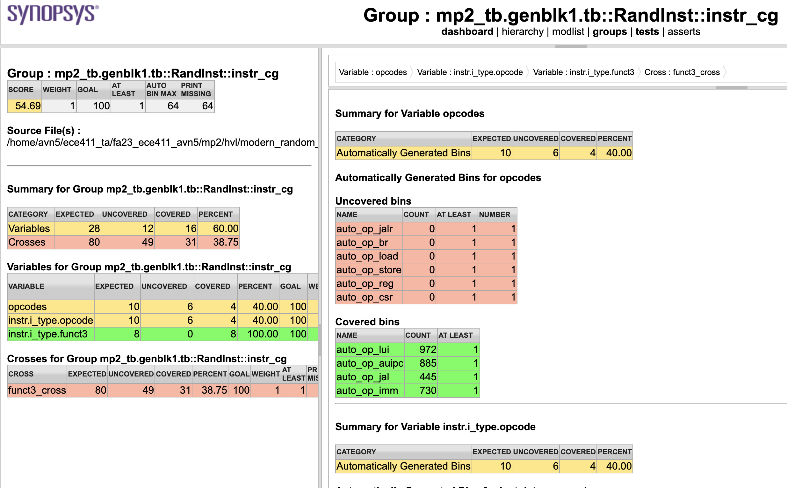
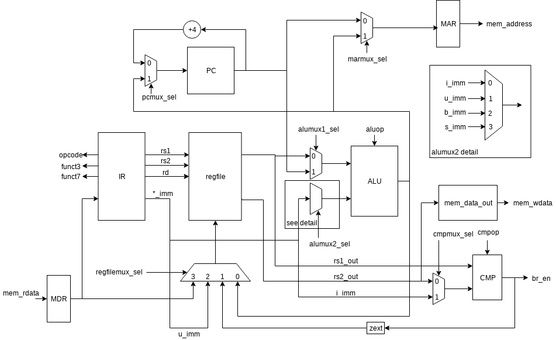

==========================
ECE 411: MP2 Documentation
==========================

---------------------------------------------
The RV32I Processor
---------------------------------------------

    The software programs described in this document are confidential and proprietary products of
    Synopsys Corp. or its licensors. The terms and conditions
    governing the sale and licensing of Synopsys products are set forth in written
    agreements between Synopsys Corp. and its customers. No representation or other
    affirmation of fact contained in this publication shall be deemed to be a warranty or give rise
    to any liability of Synopsys Corp. whatsoever. Images of software programs in use
    are assumed to be copyright and may not be reproduced.

    This document is for informational and instructional purposes only. The ECE 411 teaching staff
    reserves the right to make changes in specifications and other information contained in this
    publication without prior notice, and the reader should, in all cases, consult the teaching
    staff to determine whether any changes have been made.

.. contents:: Table of Contents
.. section-numbering::

-----

.. Aliases for appendix references
.. _Appendix A: `Appendix A: Loading programs into your design`_
.. _Appendix B: `Appendix B: Spike`_
.. _Appendix C: `Appendix C: Control`_
.. _Appendix D: `Appendix D: Datapath`_
.. _Appendix E: `Appendix E: Instructions Needed for this MP`_

Introduction
============

We will move on to study the RISC-V architecture.
In this MP we will step through the design and simulation of a simple, non-pipelined processor
that implements a subset of the RV32I instruction set architecture (ISA). This page
contains the specification for the design. You will follow
the directions to create the design and verify it using dynamic simulation.

The primary objective of this exercise is to give you a better understanding of multicycle micro-
architectures, and of the RV32I ISA. Additionally, you will learn how to use the Synopsys Design Compiler software
to synthesize your design for an ASIC, and continue using VCS and Verdi to verify your design.
Since the next MPs will require further original design effort, it is important for you to understand how
these tools work now so that you can avoid being bogged down with tool-related problems later on.

The RV32I Instruction Set Architecture
======================================

The RISC-V specification was created to be a free and open alternative to other popular ISAs. It includes a 64
bit variant and many extensions for atomic operations, floating point
arithmetic, compressed instructions, etc.

**Please read** `RISC-V specification`_ **Chapter 2 carefully for all the instructions needed to be implemted
and the specification of those instructions.** For this MP, you will implement all of the RV32I
instructions with the exception of the ``FENCE*``, ``ECALL``, ``EBREAK``, and
``CSRR*`` instructions.
For the sake of clarity, we will list all the instructions that you will need to implement in `Appendix E`_.

You can also refer to **Chapter 19** in the RISC-V spec for a more concise list of instructions.

The RISC-V specification defines several pseudo-instructions -- instructions which are
actually translated into one or more different instructions by the assembler.  These are important
to be aware of when writing test code, because some pseudo-instructions may be translated into
something you didn't expect.  See **Chapter 20** in the RISC-V spec for details.

.. _RISC-V specification: https://content.riscv.org/wp-content/uploads/2017/05/riscv-spec-v2.2.pdf

Memory Alignment
----------------

In Section 2.6 of the RISC-V spec, although it is mentioned that your CPU should support misaligned
accesses, throughout all MPs in ECE 411, we will relax this requirement: you only need to support naturally
aligned load and stores. We will not test your CPU on non-naturally aligned accesses.

However, there is also an additional requirement we impose on your memory interface:
all accesses made by your CPU must be 32-bit aligned. Say for example, if your CPU executes ``LB`` on
address ``0x10000003``, your CPU should access address ``0x10000000``, take the highest byte from ``mem_rdata``,
and put it into the lowest 8 bits in ``rd``.

Writing only some bytes within the 4 byte bus is accomplished by using ``mem_byte_enable``:
for example, SB on address ``0x10000003`` should:
- Put ``0x10000000`` as mem_address
- Put valid data on the highest byte in ``mem_wdata``
- Put ``4'b1000`` on ``mem_byte_enable``
- Raise ``mem_write``

Design Specifications
=====================

Overview
--------

Your design should be compliant with the RISC-V specification, with the exceptions of traps, error handling, and
non-naturally aligned memory access.

Signals
-------

Your processor communicates with the outside world (e.g., the memory) through an address bus,
read and write data buses, four memory control signals, and a clock.

Top Level Signals
~~~~~~~~~~~~~~~~~

``clk``
  A clock signal -- all components of the design are active on the rising edge.

``rst``
  A synchronous active-high reset signal -- sampled at the rising edge of ``clk``. When asserted, the architectural
  state should go to initial state, including the controller state machine and all the registers.

``mem_address[31:0]``
  The memory system is accessed using this 32 bit signal. It specifies the address that is to be
  read or written.

``mem_rdata[31:0]``
  32-bit data bus for receiving data *from* the memory system.

``mem_wdata[31:0]``
  32-bit data bus for sending data *to* the memory system.

``mem_read``
  Active high signal that tells the memory system that the address is valid and the processor is
  trying to perform a memory read.

``mem_write``
  Active high signal that tells the memory system that the address is valid and the processor is
  trying to perform a memory write.

``mem_byte_enable[3:0]``
  A mask describing which byte(s) of memory should be written on a memory write. The behavior of
  this signal is summarized in the following table:

  =====================  ==========
   ``mem_byte_enable``    Behavior
  =====================  ==========
   ``4'b0000``            Don't write to memory even if ``mem_write`` becomes active
   ``4'b????``            Write only bytes specified in the mask (by a 1) when ``mem_write`` becomes
                          active
   ``4'b1111``            Write all bytes of a word to memory when ``mem_write`` becomes active
  =====================  ==========

``mem_resp``
  Active high signal generated by the memory system indicating that the memory has finished the
  requested operation.

Bus Control Logic
-----------------

The memory system does not respond instantly, meaning that the processor waits for the memory to respond to a
request before it can complete the access cycle. In order to meet this constraint, inputs to the memory
subsystem must be held constant until the memory subsystem responds by raising ``mem_resp``. In addition, outputs from the
memory subsystem should be latched if necessary.

The processor sets the ``mem_read`` control signal when it needs to read data from the
memory. The processor sets the ``mem_write`` signal when it is writing to the memory (and sets
the ``mem_byte_enable`` mask appropriately). ``mem_read`` and ``mem_write`` must never be active at
the same time. The memory activates ``mem_resp`` when it has completed the read or write request.
We assume the memory response will always occur so the processor never has an infinite wait.

Controller
----------

There is a sequence of states that must be executed for every instruction. The controller contains
the logic that governs the transitions between states and the actions in each state. In RV32I, each
instruction will pass through the fetch and decode states, and once decoded, pass through any states
appropriate for the particular instruction. See `Appendix C`_ for a partial state diagram
of the controller.

PC
--

You will have to create your own PC register in the datapath. Your PC should reset to ``0x40000000``.
You should assert ``load_pc`` on the last state of each instruction.

Design Setup
============

To setup the class environment, from an EWS Linux machine, run::

  $ source /class/ece411/ece411.sh

To get the provided base code for MP2, from your ece411 MP directory, run::

  $ git fetch release
  $ git merge --allow-unrelated-histories release/mp2 -m "Merging MP2"

We also provide you several tools to help you interact with and test your design.  The most common
ones have been placed in the ``mp2/bin/`` directory, see `Appendix A`_.

Beginning the Design
--------------------

Some components for the RV32I Processor have been provided for you. You will create several missing
components, connect them together to form the datapath, and implement a controller to sequence the
machine. Take a look at the `Appendix C`_ and `Appendix D`_ to get a feel for what components
are provided and what components need to be created.

Complete the Datapath
~~~~~~~~~~~~~~~~~~~~~

The given ``datapath.sv`` file contains a couple of instantiated components and a partial port
declaration. You will need to create and instantiate additional components and declare additional
ports to complete the design.

Create the Controller
~~~~~~~~~~~~~~~~~~~~~

Next, we create the controller for the processor as a state machine in SystemVerilog. A skeleton
controller is given in ``control.sv``.

Connect the Datapath and Controller
~~~~~~~~~~~~~~~~~~~~~~~~~~~~~~~~~~~

The ``mp2.sv`` file contains the top-level module.
You need to connect the datapath and controller you just finished. To do
this, follow a similar method as you did to connect components within the datapath. Declare the
relevant internal signals, instantiate, and connect the two modules. Finish the controller for
all instructions by following the design in `Appendix C`_ and `Appendix D`_. You
will have to figure out the design for several of the instructions, including the register-register
integer computational instructions. After adding an instruction, try compiling your design and
testing the newly added instruction.

Analysis and Functional Verification
====================================

After this, you will perform RTL simulation to verify the correctness of the
design. We recommend that you test your design after adding each instruction.

The main verification file to use in simulation is ``mp2/hvl/top.sv``. This file does several things:

- Instantiates your MP2 design as the DUT
- Instantiates one of two testbenches which provide input stimulus to the DUT
- Instantiates an interface between itself, the testbench, the DUT, and memory, and generates a clock
- Provides several halting conditions for your simulation
- Instantiates ``riscv_formal_monitor_rv32i`` (which we will refer to as RVFI henceforth),
  which monitors the output as well as some of the
  internal state of the DUT. It then reports an error if the DUT outputs an incorrect value or enters
  an incorrect state. See `RISC-V Formal Verification Framework`__ for more details
- Prints out your DUT's instruction trace into a file. See `Appendix B`_

.. __: https://github.com/SymbioticEDA/riscv-formal

Note that since RVFI needs to look at the internal of your design, we have already instantiated
all the signals that need to be monitored in control and datapath. Please do not rename or remove them,
and program them according to their implied functionality. If you get the
"cross module reference error" when compiling, it is likely the case that you have modified some of these signal names.

To ensure correctness, RVFI requires all connected signals (as specified in ``top.sv``) to be correct when you raise the 'commit' signal (``load_pc`` for this MP).
Notably, this means that memory address, memory read/write data, and ``regfilemux_out`` must remain correct while incrementing the PC after finishing the read/write.

You should always raise ``load_pc`` at the last state of each instruction, and make sure all RVFI signals are still valid at that time.

Three different testbenches are provided. To choose which one to instantiate in ``mp2/hvl/top.sv``,
set the ``TESTBENCH`` macro to either ``SRC``, ``RAND``, or ``MODERN_RAND``. Note that if you want randomized testing, ``MODERN_RAND`` is highly recommended
over ``RAND``, which will be deprecated soon.

The ``SRC`` testbench drives the DUT by loading a program binary into memory, and executing the
program. This testbench should largely remain unchanged, instead modify the tests by modifying the
compiled program.
The memory is provided as a behavioral SystemVerilog file ``memory.sv``. The model reads
memory contents from the ``memory.lst`` file in the ``sim`` directory of your
MP2 project. See `Appendix A`_ for instructions on compiling RISC-V programs and loading them
into memory.

The ``RAND`` and ``MODERN_RAND`` testbenches drive the DUT by executing a sequence of randomly generated instructions.
``MODERN_RAND`` can and should be modified, as we have only provided the code to randomly generate register-immediate instructions, ``AUIPC``, ``LUI``, and ``JAL``.
We suggest extending this testbench to support simulation of randomly
generated register-register instructions, branches, and load-store instructions.
When you are running the ``MODERN_RAND`` or ``RAND`` testbench, you still need to provide a program argument to ``make run PROG=..``. Even though the program will not be run,
it is necessary to make the script in `Appendix A`_ happy.
Note that the ``RAND`` and ``MODERN_RAND`` testbenches only work with the RVFI monitor since instructions are generated on the fly, and the instruction stream is not saved after simulation.
It will not generate an ELF that can be run by Spike.

For the ``MODERN_RAND`` testbench, it is very useful to view the coverage report to see that you're actually testing all the instructions
that you should be. To view the coverage report, do ``make covrep``. This will generate the coverage reports as HTML in the directory
``sim/urgReport/dashboard.html``, which you can open in Firefox on EWS. Navigate to "Groups" to see the breakdown.

   Figure 1: The coverage report of the provided modern random testbench.

Advanced: If you are using SSH (and you don't want to X forward a web browser), you instead do the following steps to view the remote webpage on
your local browser. First, SSH into EWS with:

.. code::

    ssh -L 8000:localhost:8000 netid@linux.ews.illinois.edu

Then, navigate to ``mp2/sim/urgReport``, and start a web server:

.. code::

   python3 -m http.server 8000 &

Now, on your local machine, navigate to http://localhost:8000/dashboard.html, and you should see the coverage report.

Testbench Memory Initialization
-------------------------------

See `Appendix A`_ for how to load an assembly program into the design. Use the instructions to load
the given test code in ``mp2/testcode/riscv_mp2test.s``.

It is expected that you write your own extensive assembly tests.
The given testcode is by no means exhaustive.
We highly encourage you to extend this given test, create your own test code, or use some third-party testcode to test your design.

RTL Simulation
--------------

To run the RTL simulation, from your MP2 directory, :

.. code::

   make run PROG=PATH_TO_TESTCODE

Replace ``PATH_TO_TESTCODE`` with path to your test code.
This will invoke ``generate_memory_file.sh`` detailed in `Appendix A`_, compile your RTL design, and run the simulation.
The ``sim/compile.log`` file will contain the VCS compilation output.  Pay attention to any compiler warnings,
as they can lead to subtle bugs. The ``sim/simulation.log`` file will contain the VCS simulation output.
The simulation will print any mismatches detected by RVFI. Expected values will be prefixed with ``spec`` while your value is prefixed with ``rvfi``.

Wave Traces
-----------

To aid in debugging, we will use Synopsys Verdi. Once a simulation is run, it will dump all signals in the design in a .fsdb (Fast Signal Database) file.
Launch Verdi by running

.. code::

   ./run_verdi.sh &

Navigate to your design in the instance navigator window on the left. You will see the corresponding source code in the source window.
You can select any signal and press ``Ctrl + 4`` to add it to the waveform viewer window.

While trying to debug, you may want to edit the source code, run a simulation and observe the same set of signals. You can edit your code, and run make sim/simv,
while Verdi is running. Once the simulation has finished, press ``Shift + L`` while the Verdi window is active to reload the design. You can now view the waves
corresponding to the new simulation.

Additionally, you can save a "signal" file that instructs Verdi to load a set of signals in the waveform viewer. Once you have a set of signals added to
the waveform viewer, select the nWave window, and press ``Shift + S`` to save the file.

Next time you launch Verdi, you can restore the signals by selecting the nWave window and pressing ``r``, and selecting the file that you saved earlier.
We recommend that you refer to the full Verdi user guide. Verdi has numerous debug features that can help improve productivity.

Using Spike to Verify Your Design
~~~~~~~~~~~~~~~~~~~~~~~~~~~~~~~~~

See `Appendix B`_

Synthesis
=========

We synthesize the design using Synopsys Design Compiler. To synthesize your design, run

.. code::

   make synth

If your design is successfully synthesized, this will produce an area report and a timing report.
We target a 100 MHz clock. Given the gate delays in the 45nm node we are targeting, this is NOT an aggressive target and you should be able to
meet timing constraints easily.

The timing report will list the longest path delay in your design. If you see a positive slack value for the longest path, that means your design passes timing.
If there is a negative value, that means that particular path takes longer than 10 ns to propagate. The report will also list the gates in the pathway that will indicate
where the long piece of logic exists.

The second lab for MP2 will cover more information on Design Compiler and its GUI, Design Vision.

For full credit on this MP, your design must successfully synthesize and meet all timing constraints. There is no area constraint.
Note that this is only a requirement for the final checkpoint.

Hand-ins
========

Checkpoint 1
------------

For CP1, you must submit a design with

- **register-immediate** instructions;
- load word and store word memory instructions;
- all conditional branch operations (not ``JAL``, ``JALR``);
  (Hint: These instructions will require you write a new module)
- both U-type instructions (``LUI``, ``AUIPC``).

Checkpoint 2 / Final
--------------------

The final hand in requires you to complete the design by adding all missing instructions (with the
exception of those listed as not implemented in the `The RV32I Instruction Set Architecture`_).

Grading
=======

Autograder
----------

The autograder will test your design in two ways. First it will run many small tests that each
target a very minimal amount of functionality but together they should cover nearly all
functionality. This is the best way for the autograder to give you as much partial credit as
possible for small bugs. The second method of testing will be a larger test code that will test that
your design can successfully run larger sequences of instructions. No partial credit will be given
for this larger test code but it will not test corner cases as thoroughly as the targeted tests.

**Certain tests will be withheld from you until the CP1 and Final due-dates**. This
means that you should not treat earlier autograding runs as your verification effort. **You must
verify your own design.**

You are free to create new SystemVerilog files in ``hdl``. All SystemVerilog files present in ``hdl``
will be compiled into the grading run.

**Do not modify the following given design files, since they will be replaced by the autograder:**
``alu.sv``, ``ir.sv``, ``regfile.sv``, ``rv32i_mux_types.sv``, ``rv32i_types.sv``.

All ``hvl`` and ``pkg`` files will also be replaced in autograder. Please do not put your code in there.

Grading Rubric
--------------

====================  =====
**Item**              **%**
====================  =====
CP Targeted Tests     20
CP Longer Test        5
**CP Total**          25
Final Targeted Tests  50
Final Longer Test     15
Synthesis and Timing  10
**Total**             100
====================  =====

Appendix A: Loading programs into your design
=============================================

To load a program into your design, we need to generate a memory initialization file, ``memory.lst``,
that is placed into the simulation directory ``mp2/sim``. The ``generate_memory_file.sh`` script located in the ``mp2/bin``
directory is used to do this.

The ``generate_memory_file.sh`` script takes a RISC-V assembly file or a single C file as input, optially compile it to assembly,
assembles it into a RISC-V ELF then object file, and converts the object file into a suitable format for initializing the testbench memory.

The ``generate_memory_file.sh`` script stores all its intermediate products in ``mp2/sim/bin``.
Notably, it places the ELF version of your program there, which can be directly fed to Spike (see `Appendix B`_).
You can also find the disassembly in there, which will become very useful when debugging your design.

The ``generate_memory_file.sh`` script is part of the Makefile and gets executed automatically every time you ``make run PROG=..``.

Appendix B: Spike
=================
Spike is the golden software model for RISC-V. You can give it a RISC-V ELF file and it will run it for you. You can also interactively step through
instructions, look at all architectural states and also memory in it. However, it is likely that you do not need these features for this MP. You would
likely only want it to give you the golden trace for your program.

The compile script in ``mp2/bin`` will generate ELF file in ``mp2/sim/bin``.

To run an ELF on spike, run the following command

.. code::

  make spike ELF=PATH_TO_ELF

Replace ``PATH_TO_ELF`` with path to an ELF file
Then you can find the golden Spike log in ``mp2/sim/golden_spike.log``

In addition, code provided in ``mp2/hvl/top.sv`` will print out a log in the exact same format, which can be found at ``mp2/sim/spike.log``.
You can use your favorite diff tool to compare the two.

When you are trying to run Spike on your own testcode,
make sure to include all the lines about ``tohost`` in the example testcode, and the 4 lines that write 1 into ``tohost`` right before halting.
Spike only terminates when you ``sw`` into a special 'variable' in your assembly code, so failing to include these instructions will lead to
Spike getting stuck in the infinite loop.

Spike uses ``x5``, ``x10``, and ``x11`` for some internal purposes before it actually jumps to run the ELF you supplied.
Keep this in mind when you are writing your own test code.

Appendix C: Control
===================

.. figure:: doc/figures/control.png
   :align: center
   :width: 80%
   :alt: RV32I control state diagram

   Figure 2: Example RV32I control state diagram -- sufficient for **most** of checkpoint 1

Appendix D: Datapath
====================

   Figure 3: Example RV32I datapath diagram -- sufficient for **most** of checkpoint 1

Appendix E: Instructions Needed for this MP
===========================================

=========  ========================  ==============
**Name**   **Type**                  **Checkpoint**
=========  ========================  ==============
``LUI``    ``U-type``                1
``AUIPC``  ``U-type``                1
``JAL``    ``Unconditional Jumps``   2
``JALR``   ``Unconditional Jumps``   2
``BEQ``    ``Conditional Branches``  1
``BNE``    ``Conditional Branches``  1
``BLT``    ``Conditional Branches``  1
``BGE``    ``Conditional Branches``  1
``BLTU``   ``Conditional Branches``  1
``BGEU``   ``Conditional Branches``  1
``LB``     ``Memory``                2
``LH``     ``Memory``                2
``LW``     ``Memory``                1
``LBU``    ``Memory``                2
``LHU``    ``Memory``                2
``SB``     ``Memory``                2
``SH``     ``Memory``                2
``SW``     ``Memory``                1
``ADDI``   ``Register-Immediate``    1
``SLTI``   ``Register-Immediate``    1
``SLTIU``  ``Register-Immediate``    1
``XORI``   ``Register-Immediate``    1
``ORI``    ``Register-Immediate``    1
``ANDI``   ``Register-Immediate``    1
``SLLI``   ``Register-Immediate``    1
``SRLI``   ``Register-Immediate``    1
``SRAI``   ``Register-Immediate``    1
``ADD``    ``Register-Register``     2
``SUB``    ``Register-Register``     2
``SLL``    ``Register-Register``     2
``SLT``    ``Register-Register``     2
``SLTU``   ``Register-Register``     2
``XOR``    ``Register-Register``     2
``SRL``    ``Register-Register``     2
``SRA``    ``Register-Register``     2
``OR``     ``Register-Register``     2
``AND``    ``Register-Register``     2
=========  ========================  ==============
