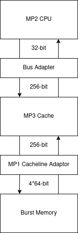
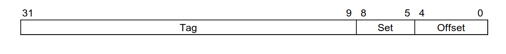
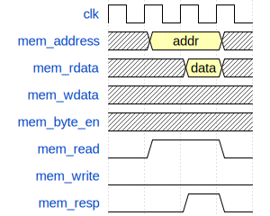
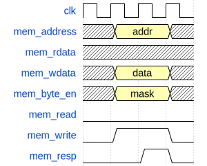
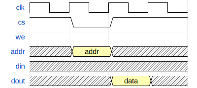
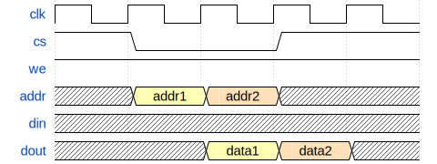
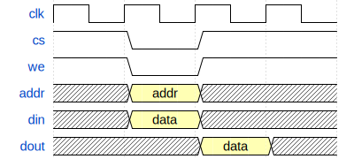
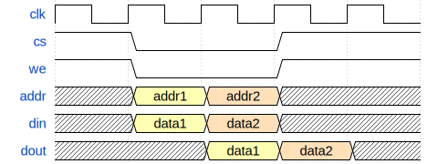

==========================
ECE 411: MP3 Documentation
==========================

--------------------------------------------------------------
The RV32I Processor with a Unified 4-Way Set-Associative Cache
--------------------------------------------------------------

    The software programs described in this document are confidential and proprietary products of
    Synopsys Corp. or its licensors. The terms and conditions
    governing the sale and licensing of Synopsys products are set forth in written
    agreements between Synopsys Corp. and its customers. No representation or other
    affirmation of fact contained in this publication shall be deemed to be a warranty or give rise
    to any liability of Synopsys Corp. whatsoever. Images of software programs in use
    are assumed to be copyright and may not be reproduced.

    This document is for informational and instructional purposes only. The ECE 411 teaching staff
    reserves the right to make changes in specifications and other information contained in this
    publication without prior notice, and the reader should, in all cases, consult the teaching
    staff to determine whether any changes have been made.

.. contents:: Table of Contents
.. section-numbering::

-----

.. Aliases for appendix references
.. _Appendix A: `Appendix A: SRAM and OpenRAM`_

Introduction
============

After MP2 you should have a working machine that implements the RV32I Instruction Set. Now, you will be augmenting
this design with a simple one-level cache.

MP3 Design Diagram
-------------------

.. _Figure 1:

   Figure 1: MP3 overview diagram.

Cache Specifications
====================

You will need to design and verify a **one-level, unified, 4-way, set-associative cache** with the
following specifications:

- 16 sets with 4 ways per set
- Each way holds an 8-word (256 bit) cache line
- Write-back with a write allocate policy
- Pseudo-LRU replacement policy
- Read/Write hits must take exactly two clock cycles to complete
- Indexing scheme following `Figure 2`_

.. _Figure 2:

   Figure 2: MP3 address format

Previously, the CPU datapath was interacting with the main memory directly. Now, you will need to
modify the interface to implement the memory hierarchy. That is, you will need to insert a cache
between the CPU's datapath and the main memory.  **You may NOT add additional signals between the
cache and the CPU datapath.** Your cache must work with the same signals that MP2 main memory used
to communicate with the CPU; i.e., the datapath must have no knowledge of your memory hierarchy. The
signals used are described in the `Signal Specifications`_ section below.

In MP3, the main memory code will be provided as ``burst_memory.sv``. This memory module mimics
the timing characteristics of a real world off-the-shelf DDR memory.
The memory interface is 64 bit, with 4 bursts per access, so that a single load will fill an entire cache line.

You will use `OpenRAM`_ for your data and tag arrays. See `Appendix A`_ for an overview of how SRAM
circuits work and how they fit into the IC design flow. Note that only the data and tag arrays are
SRAM. You may assume that valid, dirty, and LRU arrays are arrays of flip-flops with the same
interface as the SRAM.

Initially, when all your valid bits are zero, you will populate each set in PLRU order. That is, you
do **not** need to give invalid cachelines priority over whichever cacheline the PLRU logic dictates
you use.

Read/Write hits **MUST** take exactly two clock cycles to complete in this cache. Other operations
may take multiple cycles, if necessary. `Figure 3`_ illustrates what exactly is meant by two cycle hit.

.. _Figure 3:

   Figure 3A: Read hit timing diagram.

   Figure 3B: Write hit timing diagram.

.. _OpenRAM: https://openram.org/

Signal Specifications
=====================

Cache Interface Signals
-----------------------

These signals define the interface between the CPU datapath and the memory hierarchy. Each of these
signals must be present, and no additional signals are allowed.

Signals between CPU Datapath and Cache
^^^^^^^^^^^^^^^^^^^^^^^^^^^^^^^^^^^^^^

``mem_address[31:0]``
  The memory system is accessed using this 32 bit signal. It specifies the address that is to be
  read or written.

``mem_rdata[31:0]``
  32-bit data bus for receiving data *from* the memory system.

``mem_wdata[31:0]``
  32-bit data bus for sending data *to* the memory system.

``mem_read``
  Active high signal that tells the memory system that the address is valid and the processor is
  trying to perform a memory read.

``mem_write``
  Active high signal that tells the memory system that the address is valid and the processor is
  trying to perform a memory write.

``mem_byte_enable[3:0]``
  A mask describing which byte(s) of memory should be written on a memory write. The behavior of
  this signal is summarized in the following table:

  =====================  ==========
   ``mem_byte_enable``    Behavior
  =====================  ==========
   ``4'b0000``            Don't write to memory even if ``mem_write`` becomes active
   ``4'b????``            Write only bytes specified in the mask (by a 1) when ``mem_write`` becomes
                          active
   ``4'b1111``            Write all bytes of a word to memory when ``mem_write`` becomes active
  =====================  ==========

``mem_resp``
  Active high signal generated by the memory system indicating that the memory has finished the
  requested operation.

Note that your cache requires a "bus adapter" placed between the CPU and the cache to convert the 32-bit interface into a 256-bit interface. This is a **provided module**, with the following declaration:

.. code-block:: verilog

   module bus_adapter
   (
     output [255:0] mem_wdata256,
     input [255:0] mem_rdata256,
     input [31:0] mem_wdata,
     output [31:0] mem_rdata,
     input [3:0] mem_byte_enable,
     output logic [31:0] mem_byte_enable256,
     input [31:0] address
   );

This module appropriately shifts ``mem_wdata`` and ``mem_byte_enable`` on a write, and selects the
appropriate 32 bits from the 256 bit ``mem_rdata256`` input on a read. You should use it between your cache and the CPU.

Signals between Cache and Cacheline Adapter
^^^^^^^^^^^^^^^^^^^^^^^^^^^^^^^^^^^^^^^^^^^

``pmem_address[31:0]``
  Physical memory is accessed using this 32-bit signal. It specifies the physical memory address
  that is to be read or written.

``pmem_rdata[255:0]``
  256-bit data bus for receiving data *from* physical memory.

``pmem_wdata[255:0]``
  256-bit data bus for sending data *to* physical memory.

``pmem_read``
  Active high signal that tells the memory interface that the address is valid and the cache is trying to
  perform a physical memory read.

``pmem_write``
  Active high signal that tells the memory interface that the address is valid and the cache is trying to
  perform a physical memory write.

``pmem_resp``
  Active high signal generated by the memory interface indicating that the memory operation has completed.

Burst Memory Signals
^^^^^^^^^^^^^^^^^^^^

The main memory takes multiple cycles to respond to requests. When a response is ready, the memory
will assert the ``pmem_resp`` signal. Once a memory request is asserted, the input signals to memory
should be held constant until a response is received. You may assume in your design that the memory
response will always occur so the processor never has an infinite wait. As before, make sure that
you never attempt to read and write to memory at the same time. Note that these signals have been
defined for you in ``mp3/hdl/mp3.sv``.

``bmem_address[31:0]``
  Physical memory is accessed using this 32-bit signal. It specifies the physical memory address
  that is to be read or written.

``bmem_rdata[63:0]``
  64-bit data bus for receiving data *from* physical memory. Data is sent in bursts over 4 cycles.

``bmem_wdata[63:0]``
  64-bit data bus for sending data *to* physical memory. Data is written in bursts over 4 cycles.

``bmem_read``
  Active high signal that tells physical memory that the address is valid and the cache is trying to
  perform a physical memory read.

``bmem_write``
  Active high signal that tells physical memory that the address is valid and the cache is trying to
  perform a physical memory write.

``bmem_resp``
  Active high signal generated by physical memory indicating that the memory operation is executing.
  This signal will stay high for 4 cycles during a single read or write.

Note that you will require your MP1 cacheline adapter to send 256-bit cachelines to the burst memory. You should refer
to its interface from MP1, and use it in your design between the cache physical memory interface (``pmem_*``) and
the burst memory interface (``bmem_*``):

.. code-block:: verilog

    module cacheline_adaptor
    (
        input clk,
        input reset_n,

        // Port to LLC (Lowest Level Cache)
        input logic [255:0] line_i,
        output logic [255:0] line_o,
        input logic [31:0] address_i,
        input read_i,
        input write_i,
        output logic resp_o,

        // Port to memory
        input logic [63:0] burst_i,
        output logic [63:0] burst_o,
        output logic [31:0] address_o,
        output logic read_o,
        output logic write_o,
        input resp_i,
    );

The specification for the cacheline adaptor is in the MP1 documentation.

Getting Started
===============

Obtaining the Starter Code
--------------------------

Since MP3 is an extension of the work done in MP2, you should copy your completed MP2 design into a
new folder for MP3. The steps for copying and beginning MP3 are below.

1. Merge the provided MP3 files into your repository::

     $ git fetch release
     $ git merge --allow-unrelated-histories release/mp3 -m "Merging MP3"

2. Copy your MP1 cacheline adaptor design into your mp3/hdl directory::

     $ cp -p mp1/cacheline_adaptor/hdl/cacheline_adaptor.sv mp3/hdl

3. Copy your MP2 design into your MP3 directory::

     $ cp -p mp2/hdl/* mp3/hdl/cpu
     $ cp -p mp2/testcode/* mp3/testcode     # optional, do this if you wrote your own tests

4. Rename your MP2 module, located in ``mp3/hdl/cpu/mp2.sv``, from ``mp2`` to ``cpu``. You should rename both the filename and SystemVerilog module name inside the file. ::

     $ mv mp3/hdl/cpu/mp2.sv mp3/hdl/cpu/cpu.sv

Design Limitations
==================

Things you must not do
----------------------

- **DO NOT** start working on MP3 without being sure your MP2 works. While you can (and should) test
  your cache without the CPU, you will ultimately need to ensure that your designs work correctly
  together. The autograder for MP2 will continue running for some time. The autograder for MP3 will
  use your MP2 CPU located in the ``mp3`` directory, in the commit made at MP3 checkpoint deadlines.

- **DO NOT** make any changes to the CPU datapath or CPU controller beyond those required to fix bugs
  from MP2. Your CPU should have no knowledge of the memory hierarchy attached to it. If you find
  yourself changing your CPU to accommodate your cache, you've done something wrong.

- **DO NOT** model the cache behaviorally in SystemVerilog. Ensure that it is synthesizable.

- **DO NOT** modify the provided files. Most of them will be overwritten by the autograder,
  including:

  - ``pkg/*``
  - ``sram/*``
  - ``hdl/cache/bus_adapter.sv``
  - ``hdl/cpu/alu.sv`` (from MP2)
  - ``hdl/cpu/ir.sv`` (from MP2)
  - ``hdl/cpu/regfile.sv`` (from MP2)
  - ``hvl/mp3_data_array.sv``
  - ``hvl/mp3_tag_array.sv``

- **DO NOT** add files in the ``pkg/`` directory. This will not work with the autograder.

Checkpoints
===========

There will be three deadlines for MP3:

Design Checkpoint
-----------------

For the first checkpoint, you will need to submit a digital drawing (i.e., nothing hand-drawn, we
recommend using https://draw.io/ or https://www.lucidchart.com/) of your cache datapath and cache controller.
Your paper design should include a complete schematic of your datapath and a complete state machine
design for your controller. It should be detailed enough for TAs to trace the execution of cache reads and writes.
The specific requirements for your datapath are:

- Draw all the components, including the correct number of data arrays, tag arrays, valid arrays, dirty arrays, and LRU
  arrays.
- Ensure that you specify the dimensions of these arrays in the datapath diagram.
- Ensure that you show the connections for each interface port (except ``clk``), for each of these array-like components.
- The datapath must have explicitly labeled signals from the controller or other modules. Ensure that these modules are labeled.
- The datapath must handle the cases where:

  - Data is read from the data arrays on a read hit.
  - Data is loaded into the data arrays from main memory on a read/write miss.
  - Data is written to the data arrays on a write hit.
  - Data is written from the data arrays to main memory on a dirty eviction.

- The datapath must show how the PLRU is designed, and how the output of the PLRU is used in the rest of the design.
- Feel free to use additional combinational components like gates, MUXes, decoders, encoders, and other "well-known" components
  in the datapath.
- Keep your datapath schematic clean, complete, and concise. Use label connections and organize your wires well. Poorly formatted schematics will receive a grade penalty.

The requirements for the FSM description are:

- A state diagram of the cache controller with exactly four states and labeled transition conditions.
- A table for your FSM that describes your states, their transitions, and their outputs.
- Note that you must indicate the transition conditions both on the state diagram and in the table.
- The FSM must hit in two cycles.

Your design should be detailed enough for any student taking this course to build an identical, working cache based on
your specification.

In addition to the "paper" design, you should start planning how you will test your design. In no
more than a single page, answer the following questions:

1. Analyze your cache design to identify two tricky cases you will deliberately test. (2 points)
2. Provide a brief description of how you will test one of your identified cases. This
   may be either RISC-V assembly or cache input stimuli. (2 points)
3. Briefly describe how you will unit test your cache as the DUT itself, rather than as part of
   your processor. (4 points)

Deliverables
^^^^^^^^^^^^
Upload, as a single PDF document, your design (datapath and controller) and testing analysis to
Gradescope before the posted deadline. Your testing analysis should not be longer than a single page
(not including test code).

Checkpoint One
-----------------

For this checkpoint, you will be required to have cache reads working.

Checkpoint Two
--------------

For the final hand-in, you will be required to have both cache reads and cache writes working.

Grading Rubric
==============

**Total: 140 points**

- Design Checkpoint: 40 points

  - Paper Design: 32 points (hand-drawn design will receive a zero)
  - Testing Strategy: 8 points

- Checkpoint 1: 30

  - Cache Reads: 30 points

- Checkpoint 2: 70 points

  - Targeted Tests (using cache as DUT): 45 points
  - Longer Test (using cache with your CPU): 10 points
  - Timing And Synthesis: 15 points

Appendix A: SRAM and OpenRAM
============================

In the past, to generate small memories, you have used a simple array of flip flops (for example, in the MP2 register file).
Such a design does not scale for large memories like your cache data and tag arrays.
For this, we use a SRAM block, which is a hard IP.
SRAMs offer better power and area outcomes for the design as compared to flip flop based implementations.
However, SRAMs are not purely digital circuits and need to be explicitly generated and instantiated.
The tool we use to generate such IP is known as a memory compiler. For ECE 411, we use the OpenRAM memory compiler, whose
output includes a simulation-only behavioral model and a timing model.
GDS layout can also be generated, but is out of scope for this class.
VCS will use the simulation model to do, you guessed it, simulation.
DC will use the timing model black box during synthesis to give best-effort timing estimation.

We have already pre-generated the two required arrays for this MP: data array and tag array.
You do not need to directly use OpenRAM for this MP, but we suggest you play with it in preparation for MP4.

To use OpenRAM, after sourcing the usual ECE 411 script, do:

.. code::

  $ source /class/ece411/OpenRAM/env.sh

Then, go to ``mp3/sram`` and run:

.. code::

  $ make

This provided Makefile will call the OpenRAM generator, with the configurations in ``mp3/sram/config``.
To get the list of available configurations, read the OpenRAM documentation.

This will generate all relevant files in ``mp3/sram/output``.
The Makefile also converts the timing model to a format that DC can use in ``mp3/sram/synopsys_db``.
This timing model is used by the provided synthesis script.

We have provided pre-generated files in the aforementioned directories.

Here is the list of signals for the SRAM blocks:

``clk0``
  The clock.

``csb0``
  Chip select. Active low. Assert when you need to read or write.
  You have it permanently asserted for this MP.

``web0``
  Write enable. Active low. Assert when you need to write, or deassert for reading.

``addr0``
  The address.

``wmask0``
  Write mask. Active high. Valid only when ``web0`` is asserted. Only available for data array.

``din0``
  Write data.

``dout0``
  Read data.

.. _Figure 4:

   Figure 4A: SRAM single read timing diagram

   Figure 4B: SRAM consecutive read timing diagram

   Figure 4C: SRAM single write timing diagram [#]_

   Figure 4D: SRAM consecutive write timing diagram

.. [#] Technically, this is the behavior of a write-through SRAM. OpenRAM is non-write-through, so
       we have patched the provided simulation models in ``hvl/`` to conform to the behavior in the
       waveform.
