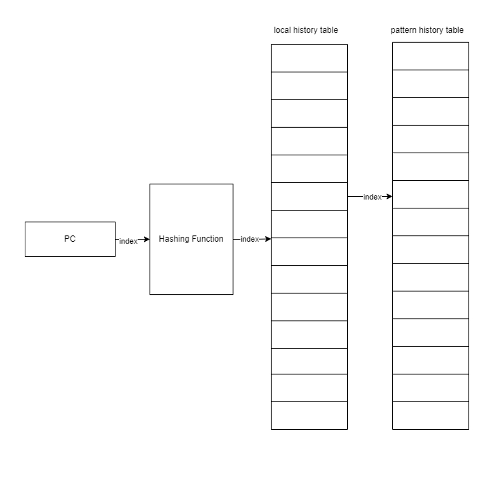
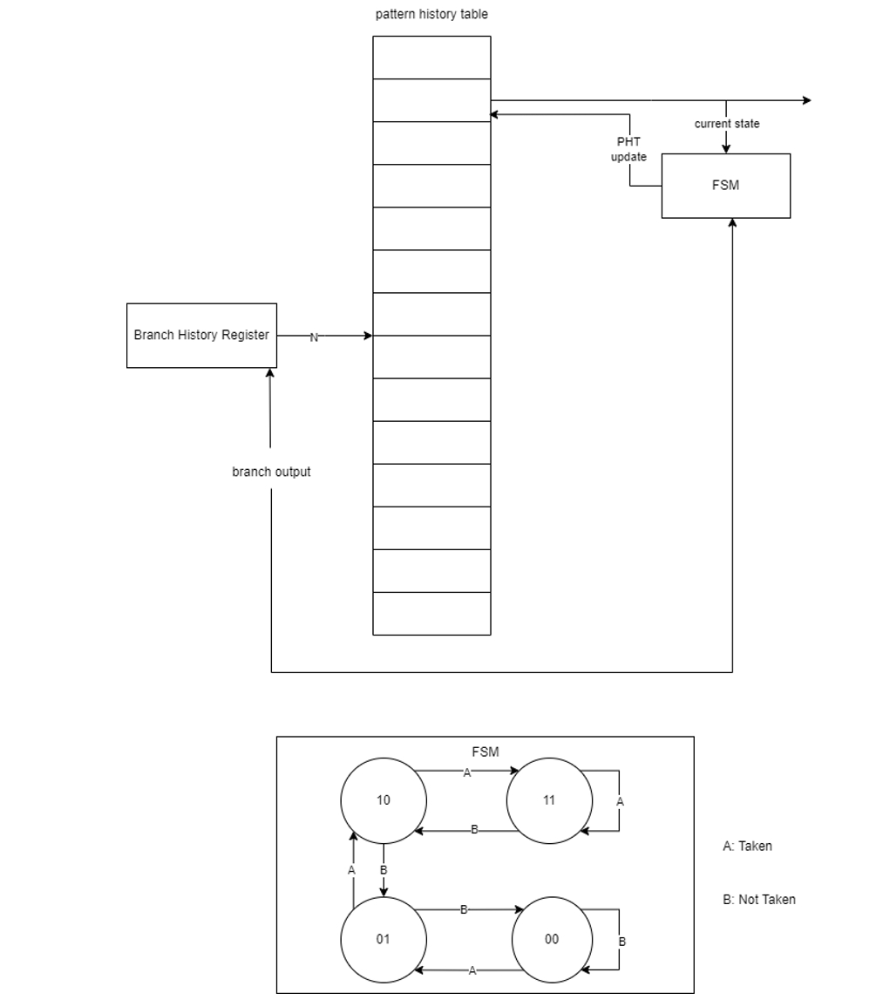
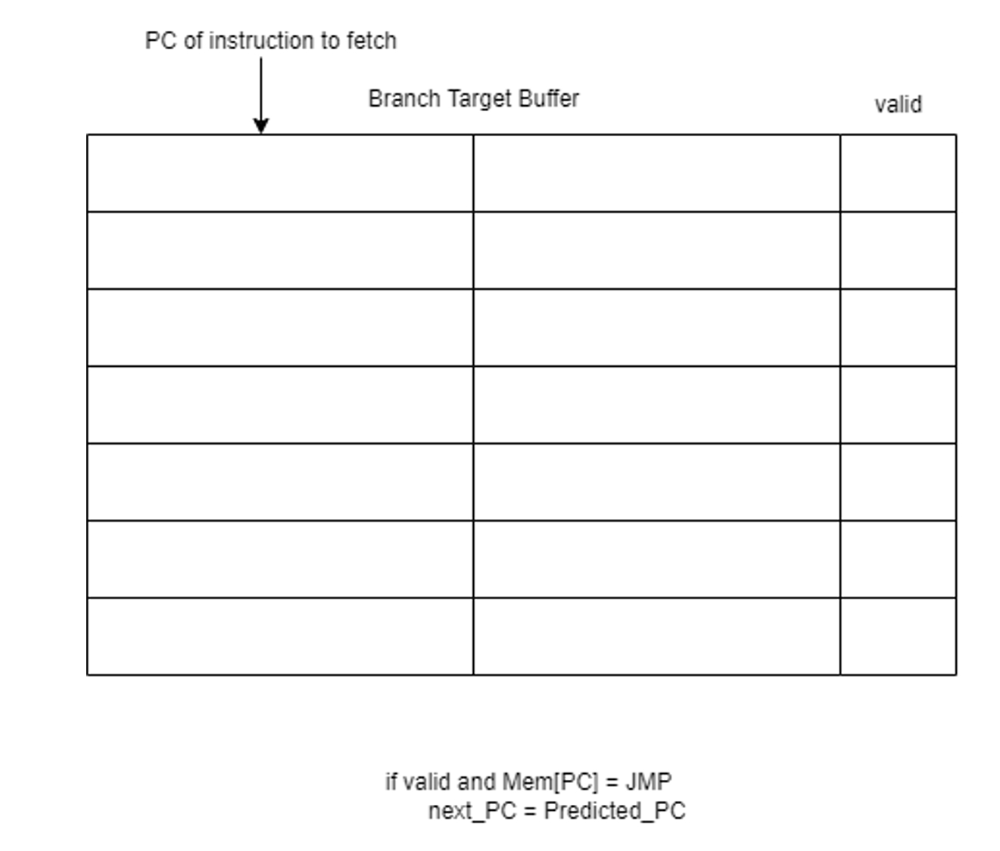
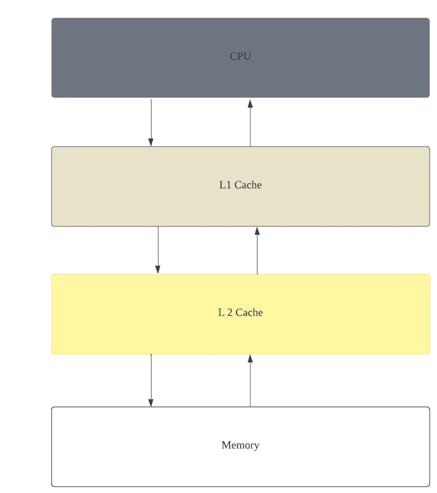

# CP3 Progress Report


<br>

## Work Distribution

- **Ziyuan Chen:** Multi-level cache, Fully customizable cache

- **Hao Ren:** Next-line prefetcher, Integration of branch predictor

- **Zhirong Chen:** Local branch predictor, Global branch predictor, 4-way associated branch target buffer


<br>

## Current Progress

- **[Done]** Pipeline processor w/ static branch prediction
- **[Done]** Multi-level cache
- **[Minor Bugs]** Fully customizable cache
- **[Working]** Branch predictors, BTB, RAS
- **[Working]** Prefetchers


<br>

## Statistics & Observations

### Prefetchers and Predictors

Context: Default 2-level cache, Conservative prefetcher, Baseline Predictor
- Baseline configuration
```
    stop time is          31500260000
    IPC: 0.236838
    L1 I Cache:    1052928 hits,        656 misses,    2111237 cycles,      8.203 penalty
    L2 I Cache:        556 hits,        100 misses,       3414 cycles,     23.020 penalty
    L1 D Cache:      73868 hits,         68 misses,     148678 cycles,     13.853 penalty
    L2 D Cache:         84 hits,         24 misses,        738 cycles,     23.750 penalty
    Predictor :    149981 misses for     211564 branch instr.
    Prefetcher:      5318 prefetches
    $finish at simulation time          31538320000
```

Context Default 2-level cache, Conservative prefetcher, Global Predictor w/ 1-Way BTB
- Shows that 1-way BTB is better than **both** Baseline and **and** 4-way BTB on Coremark.
- Shows that predictors can be beneficial to Coremark.
```
    stop time is          27107780000
    IPC: 0.275292
    L1 I Cache:     906514 hits,        603 misses,    1818190 cycles,      8.561 penalty
    L2 I Cache:        501 hits,        102 misses,       3354 cycles,     23.059 penalty
    L1 D Cache:      73868 hits,         68 misses,     148678 cycles,     13.853 penalty
    L2 D Cache:         84 hits,         24 misses,        738 cycles,     23.750 penalty
    Predictor :     76781 misses for     211564 branch instr.
    Prefetcher:      5290 prefetches
    $finish at simulation time          27143740000
```

Context: Default 2-level cache, Conservative prefetcher, Local predictor w/ 4-way BTB
- Shows that Local predictor on Coremark is better than Baseline.
```
    stop time is          31109120000
    IPC: 0.239635
    L1 I Cache:    1039890 hits,        656 misses,    2085161 cycles,      8.203 penalty
    L2 I Cache:        556 hits,        100 misses,       3414 cycles,     23.020 penalty
    L1 D Cache:      73868 hits,         68 misses,     148678 cycles,     13.853 penalty
    L2 D Cache:         84 hits,         24 misses,        738 cycles,     23.750 penalty
    Predictor :    143462 misses for     211564 branch instr.
    Prefetcher:      5318 prefetches
    $finish at simulation time          31147180000
```

Context: Default 2-level cache, Conservative prefetcher, Local predictor w/ 1-way BTB
- Shows that conservative prefetcher is ***worse*** than the case without prefetchers
- since we have few cache misses and the prefetcher won't positively affect the performance.
- The degradation is due to additional cache hit latency.
```
    stop time is          27055390000
    IPC: 0.275790
    L1 I Cache:     901272 hits,        596 misses,    1807650 cycles,      8.567 penalty
    L2 I Cache:        495 hits,        101 misses,       3319 cycles,     23.059 penalty
    L1 D Cache:      73868 hits,         68 misses,     148678 cycles,     13.853 penalty
    L2 D Cache:         84 hits,         24 misses,        738 cycles,     23.750 penalty
    Predictor :     76782 misses for     211652 branch instr.
    Prefetcher:         0 prefetches
    $finish at simulation time          27091310000
```

### Parameterized Cache

Parameter search space
- **Word size:** `{128, 256, 512, 1024}`
- **L1 cache:** `16` sets, `4` ways (fixed at CP1, CP2 baseline)
- **L2 cache:** `{16, 32, 64, 128, 256}` sets, `{4, 8, 16}` ways

*Important Notes*
- *IPCs are lower because these experiments use a commit **less optimized** in prefetching and branch prediction.*
- *Experiments are extensive, so refer to the [appendix](./mp4cp3_appendix.md) for detailed logs.* <br>
- *Here we only select configurations with a **128KB budget** for **L2 cache**.*

<br>

128 wordsize, 64 sets, 16 ways
- Miss penalty is low, but L1 cache miss rate is high.
```
    stop time is          32776490000
    IPC: 0.227675
    L1 I Cache:    1173862 hits,       8476 misses,    2395276 cycles,      5.610 penalty
    L2 I Cache:       7740 hits,        736 misses,      22125 cycles,      9.029 penalty
    L1 D Cache:      73361 hits,        575 misses,     151694 cycles,      8.647 penalty
    L2 D Cache:        784 hits,        171 misses,       3247 cycles,      9.819 penalty
    $finish at simulation time          32824340000
```

256 wordsize, 128 sets, 4 ways
- L1 I cache miss is dramatically reduced. **This is the optimal configuration given the budget.**
- This advantage is gained at the expense of an exceptional number of sets.
```
    stop time is          32477390000
    IPC: 0.229732
    L1 I Cache:    1173378 hits,       1280 misses,    2356592 cycles,      7.684 penalty
    L2 I Cache:        900 hits,        380 misses,       5997 cycles,     11.045 penalty
    L1 D Cache:      73801 hits,        135 misses,     149261 cycles,     12.289 penalty
    L2 D Cache:        106 hits,         87 misses,       1254 cycles,     11.977 penalty
    $finish at simulation time          32520420000
```

512 wordsize, 16 sets, 16 ways *OR* 512 wordsize, 32 sets, 8 ways
- Larger word size introduces heavier miss penalty, which is starting to outweigh the benefit of reducing misses.
- So we would rather go for the fine-grained approach with smaller words and more sets.
```
    stop time is          33299490000
    IPC: 0.223949
    L1 I Cache:    1259468 hits,        505 misses,    2524084 cycles,     10.194 penalty
    L2 I Cache:        305 hits,        200 misses,       3634 cycles,     15.120 penalty
    L1 D Cache:      73890 hits,         46 misses,     148641 cycles,     18.717 penalty
    L2 D Cache:          2 hits,         45 misses,        723 cycles,     15.978 penalty
    $finish at simulation time          33341460000
```

1024 wordsize, 16 sets, 8 ways *OR* 1024 wordsize, 32 sets, 4 ways
- Penalty is almost doubled and we are worse off!
- Although the 17252KB Coremark instructions finally seems to fit in the L1 I cache.
```
    stop time is          33378390000
    IPC: 0.223395
    L1 I Cache:    1269162 hits,        139 misses,    2541183 cycles,     20.568 penalty
    L2 I Cache:         36 hits,        103 misses,       2443 cycles,     23.019 penalty
    L1 D Cache:      73912 hits,         24 misses,     148481 cycles,     27.375 penalty
    L2 D Cache:          0 hits,         24 misses,        585 cycles,     24.375 penalty
    $finish at simulation time          33419590000
```


<br>

## Leftover Issue from CP2: Branch & Jump Instructions

### What's required?

- PCMUX outside EX MEM pipeline register
    - EX enabled and EX commit : Load PCMUX in EX stage
    - EX disabled and IF commit : Load PCMUX with `pcplus4`

- Disable IF, ID, EX stages when there is a branch committed to PCMUX register
    - When IF, EX are committed at the same time, the instruction propagating to ID is wrong (current PC + 4)
    - Fix 1: Do not enable IF during the next `RDY -> BUSY` transition
    - Fix 2: Use `IF_mask` register to mask the if_enable signal

### Steps

1. Remove legacy `PCMUX` in pipeline register **[Done]**
2. Create new `PCMUX` register, wire the input and output **[Done]**
3. Wire `load_pc_mux` signal, export `ex_enable` from `hazard_ctrl.sv` **[Done]**
4. Add `IF_mask` reg, wire the logic **[Done]**
5. Mask `if_enable` *transition- if `IF_mask` is asserted **[Done]**


<br>

## Hao Ren's Current Work: Next-Line Prefetcher

- How can the next-line prefetcher improve performance of a processor?
    - We use the time when DMEM and IMEM are both idle to prefetch the next cacheline
    - We need the arbiter to give a status feedback `is_idle`

- Then how can we preempt the memory?
    - By modifying the arbiter

- How do we know what cache-line to pre-fetch?
    - By recording the last cacheline read from IMEM

### Steps
1. Know the arbiter implementation (how to preempt the memory)

2. Record the last read imem cacheline
    - Can incorporate the branch taken signal
    - If the branch taken signal is high, we can skip the current prefetch.
    - So we need a storage unit checking if between memory requests, if there is a branch taken signal.

3. Modify the arbiter to preempt the memory
    1. First, we **must NOT expose the cacheline read to CPU**,
        hence the `ipmem_resp` must not be asserted upon a prefetch.
    2. Second, we must modify the state transition
        - The prefetch state can be reached when the state machine is idle and there is no memory request at the moment

### Testing Strategy

Testing a next-line prefetcher in a processor involves verifying its ability to improve performance by pre-fetching data, ensuring proper integration with the memory system, and confirming that it behaves correctly under various scenarios. Here’s a concise testing strategy:

1. **Prefetch Functionality Tests**
    - **Basic Prefetch Operation:** Verify that the prefetcher correctly fetches the next cache line when the data memory (`dmem`) and instruction memory (`imem`) are idle.
    - **Integration with Arbiter:** Test the interaction between the prefetcher and the arbiter to ensure the prefetcher can preempt memory correctly and the arbiter provides accurate `is_idle` status.

2. **Branch Prediction Integration**
    - **Branch Taken Signal Handling:** Test how the prefetcher responds to the branch taken signal. Ensure it skips prefetching appropriately when the signal is high.
    - **Record and Respond to Cache Lines:** Verify the prefetcher correctly records the last read `imem` cache line and uses this information for subsequent prefetch decisions.

3. **State Machine and Control Logic Verification**
    - **State Transition Testing:** Confirm that the state machine transitions correctly, especially the introduction of the prefetch state. Ensure this state is only entered when appropriate (e.g., when the system is idle and there’s no pending memory request).
    - **Response Suppression:** Verify that cache line reads by the prefetcher are not exposed to the CPU (`ipmem_resp` should not be asserted for prefetch operations).


<br>

## Zhirong Chen's Current Work: Branch Predictor


### Local Branch Predictor

- How to implement a local branch predictor?
    - We need a pattern history table (PHT) to record the branch history
    - We need a specific function to index the PHT. For local branch predictor, we use the PC to index the PHT, and the PHT will give us the prediction result.
    - We need a finite state machine to update the PHT

### LBP Testing Strategy (See details in `hvl`)

1. **Initialization and Reset**
    - Start with initializing all inputs to default values.
    - Assert and deassert the reset signal to ensure the branch predictor is in its initial state.

2. **Branch Taken Test**
    - Simulate a branch taken scenario by setting `actual_branch_taken` to `1`.
    - Update the branch predictor with a specific PC value (`update_branch_pc`).
    - Predict the branch behavior for the same PC and check if the prediction is `1` (branch taken).
    - Verify the state transition of the predictor using assertions.

3. **Branch Not Taken Test**
    - Similar to the branch taken test, but this time simulate a branch not taken scenario by setting `actual_branch_taken` to `0`.
    - Update the predictor and check if the prediction is `0` (branch not taken).
    - Again, use assertions to verify the state transition.

4. **Waveform Analysis**
    - Use the generated FSDB file to analyze the waveforms in a simulation tool. This helps in visualizing the signal transitions and timing relationships.

5. **Monitoring and Logging**
    - Continuously monitor and log the status of key signals (`valid`, `actual_branch_taken`, `prediction`, `expected_state`) to debug and verify the behavior of the predictor.




### Global Branch Predictor

- How to implement a global branch predictor?
    - We need a branch history register (BHR) to record the branch history
    - We need a specific function to index the PHT. For global branch predictor, we use the BHR to index the PHT, and the PHT will give us the prediction result.
    - We need a finite state machine to update the PHT

### GBP Testing Strategy

For testing a global branch predictor in a SystemVerilog environment, the strategy should be focused on thoroughly evaluating its prediction accuracy and response under various scenarios. Here's a detailed testing strategy:

1. **Initialization and Baseline Setup**
    - **Initialize Test Environment:** Start by initializing all inputs and control signals. Ensure that the global branch predictor (GBP) is in a known state before beginning tests.
    - **Reset Sequence:** Apply a reset to the GBP to verify it returns to its default state correctly. This step is crucial for ensuring consistent test conditions.

2. **Test Different Branch Scenarios**
    - **Branch Taken Tests:** Simulate scenarios where branches are predominantly taken. Vary the patterns of branches (like consecutive takens, alternating, etc.) to evaluate how quickly and accurately the GBP adapts its prediction.
    - **Branch Not Taken Tests:** Similarly, simulate scenarios with mostly not-taken branches, again with varying patterns.
    - **Mixed Branch Behavior:** Test with a mix of taken and not-taken branches in unpredictable patterns to evaluate the GBP's performance under realistic and complex scenarios.

3. **Evaluate Learning and Adaptation**
    - **Testing Learning Ability:** Evaluate how well the GBP learns from historical branch outcomes. This can be done by repeating certain branch patterns and observing if the prediction accuracy improves over time.
    - **Adaptation to Changing Patterns:** Test the GBP's ability to adapt to changes in branch behavior. For example, after a long sequence of taken branches, switch to not-taken branches and assess how quickly the GBP adjusts its predictions.

4. **Stress Testing**
    - **Rapid Changes in Branch Directions:** Apply rapidly changing branch directions to test the GBP's responsiveness and stability.
    - **High-Frequency Branch Updates:** Test with branch updates at a high frequency to assess the GBP's performance under pressure and its ability to keep up with quick changes.




### Branch Target Buffer

- How to implement a branch target buffer?
    - We need a branch target buffer (BTB) to record the branch target
    - We need a specific function to index the BTB
    - We need a finite state machine to update the BTB
    - For the 4-way associate BTB, we need a specific function to select the BTB way

For branch target buffer, we use the PC to index the BTB, and the BTB will give us the branch target.




### Top Predictor

Only when the predictor predicts the branch is taken, and branch target buffer is valid, we can use the predictor to predict the branch target.


<br>

## Ziyuan Chen's Current Work: Multi-Level and Parameterized Cache

### Multi-level Cache

A multilevel cache is a hierarchical caching system used in modern computer architectures to improve data access times and overall system performance. It typically consists of several layers of cache, each varying in size, speed, and proximity to the CPU.

**Concept and Purpose**
- **Improved Performance:** The primary objective is to reduce the average time to access data by bridging the speed gap between the fast CPU and the slower main memory.

**Cache Levels**
- **L1 Cache**
   - Located on the CPU chip, offering the fastest access speeds.
   - Typically the smallest in size, ranging from a few kilobytes to several tens of kilobytes.
   - Often split into separate instruction and data caches (L1i and L1d).
- **L2 Cache**
   - Can be on the CPU chip (integrated) or on a separate chip close to the CPU.
   - Larger than L1, usually ranging from tens to hundreds of kilobytes.
   - Serves as an intermediate store between the ultra-fast L1 cache and the larger L3 cache.

**Operation Mechanism**
- **Data Access:** When the CPU needs to access data, it first checks the L1 cache. If the data is not there (a cache miss), it proceeds to the L2 cache, and so on, until the data is found or it reaches the main memory.

**Impact on System Performance**
- A well-designed multilevel cache significantly reduces data access times and improves the overall speed and efficiency of a computer system. It plays a critical role in achieving the performance levels expected from modern CPUs.

**Testing Strategy**
- **Cache Hit and Miss Tests:** Test the cache hit and miss logic to ensure it correctly identifies cache hits and misses.

- **Cache Replacement Policy Tests:** Test the cache replacement policy to ensure it correctly identifies the cache line to be replaced when a cache miss occurs.

- **Cache Write Policy Tests:** Test the cache write policy to ensure it correctly handles write requests (write-through or write-back).

- **Cache Coherency Tests:** Test the cache coherency logic to ensure it correctly handles read and write requests from the CPU and memory.

- **Cache Size and Associativity Tests:** Test the cache size and associativity to ensure it meets the design requirements.

- **Cache Latency Tests:** Test the cache latency to ensure it meets the design requirements.




### Fully customizable cache

A fully parametrized cache is a versatile and adaptable caching mechanism, designed to be highly configurable based on various parameters. This flexibility allows it to be tailored to specific system requirements or application needs. Here's a concise introduction to the concept:

**Key Features**
- **Configurable Parameters:** Parameters such as cache size, block size, associativity, replacement policy, and write policy can be dynamically adjusted.
- **Adaptable Design:** This approach makes the cache suitable for a wide range of applications, from embedded systems to high-performance computing.

**Design and Implementation**
- **Generic Structure:** The cache is designed with a generic architecture, allowing parameters to be set at either compile-time or run-time, depending on the implementation.
- **Modular Approach:** Often implemented in a modular fashion, enabling easy integration into various systems and processors.

**Advantages**
- **Flexibility:** Can be optimized for specific workloads or system architectures.
- **Scalability:** Easily scalable to different sizes and configurations to meet changing performance and power requirements.
- **Reusability:** The parametric design allows for reuse in different system designs, reducing development time and cost.

**Testing Strategy**
- **Cache Size and Associativity Tests:** Test the cache size and associativity to ensure it meets the design requirements.
- **Cache Replacement Policy Tests:** Test the cache replacement policy to ensure it correctly identifies the cache line to be replaced when a cache miss occurs.
- **Cache Write Policy Tests:** Test the cache write policy to ensure it correctly handles write requests (write-through or write-back).
- **Cache Coherency Tests:** Test the cache coherency logic to ensure it correctly handles read and write requests from the CPU and memory.
- **Cache Latency Tests:** Test the cache latency to ensure it meets the design requirements.


<br> <br>

# Road Map for CP4

## Work Distribution

- **Ziyuan Chen:** Fully customizable cache, optimize cache parameters

- **Hao Ren:** Next-line prefetcher, optimize prefetching strategy

- **Zhirong Chen:** LBP, GBP, BTB, 4-way associated BTB; try Tournament Predictor and G-Shore Predictor.

## List of Features & Direction of Optimization

- Fully customizable cache
    - Word size
    - Number of sets
    - Associativity
    - Replacement policy
    - Write policy
- Next-line prefetcher
    - Prefetch strategy
    - Prefetch depth
- Local branch predictor
    - Branch history table: size & index function
    - FSM
- Global branch predictor
    - Branch history register: size & index function
    - FSM
- Branch target buffer
    - Branch target buffer: size & index function
    - 4-way associated BTB
    - FSM
